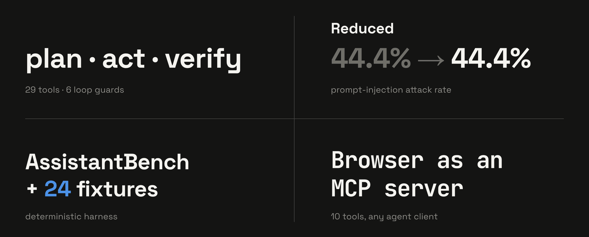

# WebOperator — AI browser agent and MCP server for Chrome automation

Tell Chrome what you want done, in plain English, and let the agent do it.

```bash
git clone https://github.com/KazKozDev/WebOperator.git
npm --prefix WebOperator/core ci
npm --prefix WebOperator/core run build
```


Your goal, typed once · The agent plans, acts, verifies · Every step visible

## Quick start

Two ways in. If you would rather not touch Node, grab the
`weboperator-1.5.0-chrome.zip` archive from the
[latest release](https://github.com/KazKozDev/WebOperator/releases/latest) and unzip it —
that folder *is* the built extension.

If you ran the commands above instead, the build lands in `core/dist` and finishes in
well under a second:

```text
vite v8.0.11 building client environment for production...
✓ 101 modules transformed.
✓ built in 189ms
```

Either way, open `chrome://extensions`, enable Developer mode, click **Load unpacked**, and point it at the folder you just got. Press `Cmd+Shift+K` (`Ctrl+Shift+K` on Linux) to open the side panel, pick a provider under **Settings**, and type a goal.

Out of the box the agent talks to Ollama at `http://127.0.0.1:11434`, so have a tool-capable local model running before your first task — or paste an API key and use a remote provider instead.

## Automate a multi-step task across your open Chrome tabs

WebOperator works the tab you are looking at in a plan → act → verify loop: it writes out a plan you can read, calls one browser tool at a time, and checks each result against a fresh snapshot of the page before moving on.

```text
Summarize the current page
```

It can navigate, click, type, press keys, scroll, switch tabs, screenshot, and pull out structured text — so the same loop still works when the answer is scattered across half a dozen open tabs.

```text
Compare info across tabs
```

The side panel streams the plan, every action, and the final answer, and keeps the full trace; history, checkpoints, and scheduled runs each get their own tab. The flip side: the agent only knows what it can actually see in the browser, so anything hidden, paywalled, or geo-blocked simply will not show up in the answer.

<br>

<p align="center">
  
</p>

- **Agent engineering** — a plan, act and verify loop, 29 browser tools, 6 loop guards
- **LLM security** — the prompt-injection attack rate down from 44.4% to 0.0% across 9 adversarial fixtures
- **LLM evaluation** — AssistantBench and 24 fixtures in a deterministic harness, see [docs/evals.md](docs/evals.md)
- **MCP** — the browser exposed as an MCP server with 10 tools for any agent client

<br>

## Schedule recurring browser automation in Chrome

Some tasks you want done whether or not you are at the keyboard. Give a schedule a start URL, a goal, and a cadence — `once`, `hourly`, `daily`, or `weekly` — and Chrome alarms wake the agent on time, even with the side panel closed.

```text
Task name:  Morning release check
Start URL:  https://github.com/KazKozDev/WebOperator/releases
Repeat:     daily
Goal:       Tell me if a new version was published since yesterday
```

Every run lands in History with its trace, so you can go back afterwards and see exactly what it did. If a run hits something only you can clear — a login wall, a verification challenge — it stops and marks itself `needs_user` rather than failing quietly.

## Connect Hermes, OpenClaw, or another MCP agent

Your live browser can be somebody else's tool. The local bridge speaks MCP over stdio and exposes ten of them: `browser_snapshot`, `browser_navigate`, `browser_click`, `browser_type`, `browser_press`, `browser_scroll`, `browser_screenshot`, `browser_extract`, `browser_solve_captcha`, and `weboperator_execute_goal`.

```bash
cd weboperator-bridge
./install.sh
node mcp-server.js
```

`install.sh` registers the Native Messaging host that wires those calls to your active Chrome or Brave tab. Drop-in configs for Hermes and OpenClaw are already in `weboperator-bridge/`.

## How it works

A goal arrives from the side panel or from an external MCP agent. From there the service worker runs the show — model calls, task state, retries, verification, schedules, storage. The content script does the hands-on part: it turns the page into an accessibility snapshot with stable element refs, then performs DOM actions against those refs. Whatever the page says is treated as data, never as instructions to follow. Twelve built-in skills sit on top as domain playbooks and kick in when the agent recognizes a matching site or task.

```text
goal → page snapshot → model tool call → verified action → trace
```

## Permissions

To read and act on the page you point it at, the extension asks for `<all_urls>` plus `activeTab`/`tabs`/`scripting`, and for `debugger` to reach the DevTools Protocol actions the plain DOM API cannot do. The rest are housekeeping: `sidePanel` for the UI, `storage` for settings and history, `alarms` for scheduled runs, `downloads` for the file-downloader skill, and `nativeMessaging` for the MCP bridge. `bookmarks` and `tabGroups` are optional and only requested when something actually needs them.

The `debugger` permission is why Chrome shows a yellow "WebOperator started debugging this browser" bar while an action runs. That bar belongs to Chrome, not to the extension, and it goes away as soon as the agent detaches.

## Configuration

| Option | Default | What it does |
|---|---|---|
| Provider | `ollama` | Selects Ollama, Anthropic, DeepSeek, Gemini, MLX, OpenAI, an OpenAI-compatible endpoint of your own, OpenRouter, SiliconFlow, or xAI |
| Base URL (OpenAI-compatible) | `http://127.0.0.1:8080/v1` | Points the OpenAI-compatible provider at llama.cpp, LM Studio, vLLM, LiteLLM, or any gateway |
| Ollama URL | `http://127.0.0.1:11434` | Sets the local Ollama endpoint |
| Screenshot policy | `auto` | Controls automatic, always-on, or disabled vision |
| Action timeout | `10000` ms | Limits a single browser action attempt |
| Domain allowlist / blocklist | empty | Restricts or rejects tasks by domain when populated |

### Bridge authentication

The bridge listens on `127.0.0.1:8765` and will accept unauthenticated calls until you set
`WEBOPERATOR_API_TOKEN`. Set it. Every bridge variable — bind host, port, socket and log
paths — is documented in [docs/api.md](docs/api.md).

## Requirements

- Chrome 120 or newer, or a Chromium browser of the same generation
- Node.js and npm, if you build the extension yourself
- A model that can call tools, served locally by Ollama or MLX or reached through one of the remote providers in the table above. Tool calling is the one hard requirement, because tool calls are the only way the agent acts. Reasoning and vision are nice to have — without them the agent still runs, and the step trace tells you which one it went without
- The extension is not on the Chrome Web Store, so you load it unpacked
- macOS or Linux, for the MCP bridge installer
- `shellcheck`, only if you run the full local check gate

## Limitations

- Dynamic, canvas-heavy, or infinite-scroll pages can invalidate element refs between the moment the agent looks and the moment it acts.
- Sites with bot detection or unusual focus handling can fail outright.
- Long tasks drift. Checkpoints and context compression hold it back, but do not cure it.
- Point it at a remote provider and that provider sees your page observations — text and screenshots included.
- Chrome and Brave are the browsers we test. Other Chromium builds and Windows are untested, and the bridge installer flatly refuses to run outside macOS and Linux.

## Troubleshooting

- **`Ollama 403`** — Ollama is refusing the extension's origin. Restart it with `OLLAMA_ORIGINS="chrome-extension://*,http://localhost:*" ollama serve`.
- **"Model stopped issuing tool calls"** — the model cannot call tools, or is too small to do it reliably. Swap it; tool calling is the one hard requirement.
- **Chrome rejects the folder on Load unpacked** — point it at `core/dist` or at the unzipped release folder, not at the repository root.
- **The bridge answers `401`** — you set `WEBOPERATOR_API_TOKEN` on the bridge but the client is not sending it. Add `Authorization: Bearer $WEBOPERATOR_API_TOKEN` to the request.
- **A task fails on a page that looks fine** — check the step trace in the side panel first; a stale element ref or a bot-detection wall shows up there as the failing action.

## Contributing

Bug reports, feature requests and pull requests are all welcome.
[CONTRIBUTING.md](CONTRIBUTING.md) walks through the setup, the eight-step check gate every
change has to clear, and the commit conventions. Released versions are listed in
[CHANGELOG.md](CHANGELOG.md).

Found a security problem? Please don't open a public issue — report it privately, the way
[SECURITY.md](SECURITY.md) describes.

<details>
<summary>Manual installation, Docker, development setup</summary>

### From a release
Each archive on the [releases page](https://github.com/KazKozDev/WebOperator/releases) ships
with a `.sha256` beside it, and is built and published by the `release` workflow from the
tagged commit once the full check gate passes.

### From source
`npm --prefix core ci && npm --prefix core run build`, then load the result as an unpacked extension.

### Docker
There is no Dockerfile or Compose configuration.

### Development
`npm --prefix core run dev` gives you watch builds. `./scripts/check.sh` runs the whole gate: fixture evals, bridge smoke test, typecheck, lint, unit tests, dead-code scan, shellcheck, and build.

</details>

</br></br>
<div align="center">

[](https://github.com/KazKozDev/WebOperator/actions/workflows/check.yml) [](core/manifest.config.ts) [](core/package.json) [](LICENSE)

[Issues](https://github.com/KazKozDev/WebOperator/issues) · [LICENSE](LICENSE) · [API](docs/api.md) · [ARCHITECTURE](docs/architecture.md) · [Agent protocol](docs/agent-protocol.md) · [LinkedIn](https://www.linkedin.com/in/kazkozdev/)

</div>
