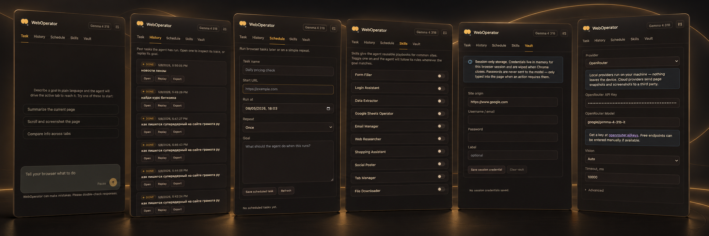

<p align="center">
  
</p>

# WebOperator

Tell your browser what to do. A small browser agent that lives inside Chrome.

You give it a task in the side panel. It looks at the active tab, asks an LLM what to do next, and executes browser tools such as `click`, `type`, `navigate`, `extract`, and `done`. The interesting part is not the UI. The interesting part is the loop: observe the page, make one tool call, verify the effect, update the trace, repeat.

The interface is natural language: describe what you want done, and the agent turns that into a visible plan and browser tool calls.

This repo is intentionally not a framework. It is a Chrome extension with the agent loop in plain TypeScript.

<p align="center">
  
</p>

## Quick start

```bash
cd core
npm install
npm run build
```

Then in Chrome:

1. Open `chrome://extensions`.
2. Enable Developer mode.
3. Click Load unpacked.
4. Select `core/dist`.
5. Open a tab you want the agent to operate on.
6. Open the WebOperator side panel and describe the task in natural language.

For development:

```bash
cd core
npm run dev
```

This runs a watch build. Reload the extension after rebuilds.

## Models

WebOperator can talk to local and remote model backends. The current code has clients for:

- Ollama
- OpenAI-compatible APIs
- xAI
- OpenRouter
- MLX

The original local path is Ollama:

```bash
ollama serve
ollama pull gemma4:26b
```

Chrome extensions need to be allowed as an origin. If the UI shows `403 Forbidden`, restart Ollama with:

```bash
OLLAMA_ORIGINS="chrome-extension://*,http://localhost:*" ollama serve
```

On macOS, quit the Ollama menu bar app first if it is already running.

## What the agent sees

Each step starts from an observation:

- the current URL and title
- a compact accessibility snapshot
- stable element refs like `@e12`
- visible text snippets
- optional screenshot / set-of-mark overlay
- the visible task plan
- previous tool results

Page content is treated as untrusted observation. It is not allowed to instruct the model.

## The loop

At a high level:

```text
snapshot page
build prompt
LLM returns exactly one tool call
execute tool call
verify action result
save trace
repeat
```

The loop is in `core/src/background/agent-loop.ts`.

The content script owns browser-page mechanics: accessibility extraction, element refs, DOM actions, overlays, and extraction. The background worker owns planning, retries, model calls, action verification, storage, and task status.

## Planning

The agent is forced to plan through a tool call:

```text
set_task_plan(steps, reason)
```

This is deliberate. The extension should not invent a local heuristic plan from the user prompt. The LLM must first state its interpretation of the user intent and produce a concrete 3-8 step plan. The side panel renders this plan and tracks progress through it.

If the model tries to browse, click, type, extract, or finish before setting a plan, the loop blocks the action and asks for `set_task_plan` again.

## Tool calls

The model must return tool calls, not prose JSON. For example:

```text
navigate(url)
click(ref, reason)
type(ref, text, mode, submit)
extract(refs, note)
done(success, summary)
```

If the model answers with plain text or raw JSON, the loop performs one repair turn and asks for a valid tool call. If repair fails, the task fails loudly instead of silently drifting.

## Long tasks

Long tasks are handled by checkpointing and compacting history. The agent can:

- keep a visible plan
- start and finish subtasks
- update task memory
- resume after bounded step windows
- compact old history before continuing
- keep step ids globally unique across resume windows

This is still a browser agent, so it can get stuck. The UI keeps the trace visible so the failure mode is inspectable.

## Safety rails

The extension includes a few simple rails:

- domain allow/block checks
- confirmation for critical actions
- password masking in snapshots, storage, UI events, and export
- action result verification
- DOM hash checks for cache replay
- evidence checks before final `done`
- local history stored in IndexedDB

There is no telemetry. Exports happen only when the user clicks export.

## Skills, schedules, and vault

WebOperator has a small set of built-in skills. They are just prompt playbooks for common browser work: filling forms, extracting data, using Google Sheets, managing tabs, shopping, email, login flows, and downloads. The agent can auto-select them from the task text, or you can turn them on manually.

There is also a local scheduler for recurring browser tasks, and a local credential vault for login flows. The vault is not magic: the agent can only use saved credentials through an explicit `fill_login_credentials` tool call. Passwords are masked in snapshots, traces, UI events, and exports. The agent should never invent, print, or leak credentials.

## Local agent API

External agents can talk to WebOperator through the optional local bridge in `weboperator-bridge/`. The Chrome extension starts the bridge through Native Messaging, and agents can use the bridge's framed JSON socket or compatibility HTTP API:

```text
Agent -> framed JSON socket -> WebOperator Native Messaging host -> Chrome extension -> active tab
```

Hermes and other agents can connect through this Local Agent API.

Install the native host, then reload the extension:

```bash
cd weboperator-bridge
./install.sh
```

For the framed socket protocol, see `docs/agent-protocol.md`. For token auth, HTTP request/response details, and SSE task events, see `docs/api.md`.

The API can return browser data and run browser actions:

```bash
WEBOPERATOR_API_TOKEN=dev-token \
  node weboperator-bridge/agent-client.js '{"type":"bridge.health"}'

WEBOPERATOR_API_TOKEN=dev-token \
  node weboperator-bridge/agent-client.js '{"type":"browser.snapshot"}'
```

Compatibility HTTP examples:

```bash
curl http://127.0.0.1:8765/health
curl http://127.0.0.1:8765/v1/browser/snapshot
curl -X POST http://127.0.0.1:8765/v1/browser/navigate \
  -H 'content-type: application/json' \
  -d '{"url":"https://example.com"}'
curl -X POST http://127.0.0.1:8765/v1/tasks \
  -H 'content-type: application/json' \
  -d '{"goal":"Extract the visible invoice total","autoConfirm":true}'
```

Useful endpoints:

- `GET /v1/browser/snapshot`
- `GET /v1/browser/screenshot`
- `POST /v1/browser/navigate`
- `POST /v1/browser/click`
- `POST /v1/browser/type`
- `POST /v1/browser/press`
- `POST /v1/browser/scroll`
- `POST /v1/browser/extract`
- `POST /v1/tasks`
- `GET /v1/tasks`
- `GET /v1/tasks/:id`
- `GET /v1/tasks/:id/trace`
- `GET /v1/tasks/:id/events`
- `POST /v1/tasks/:id/wait`
- `POST /v1/tasks/:id/stop`

Task events use Server-Sent Events, so agents can subscribe without polling:

```bash
curl http://127.0.0.1:8765/v1/tasks/<task-id>/events
```

This is local-only by default. Do not expose the bridge port to a network.

## Project layout

```text
core/
  src/
    background/
      agent-loop.ts        the main browser-agent loop
      service-worker.ts    Chrome extension entrypoint
      cdp-actions.ts       debugger/CDP fallback actions

    content/
      content-script.ts    page snapshotting, refs, DOM actions, overlays

    lib/
      tools.ts             tool schema exposed to the model
      prompts.ts           system and repair prompts
      planner.ts           parsing and progress for explicit model plans
      actions.ts           action dispatch
      verifier.ts          action verification
      storage.ts           Dexie/chrome storage helpers
      *-client.ts          model provider clients

    sidepanel/
      App.tsx              React UI
      styles.css           UI styles

docs/
  architecture.md          one-page system map
  evals.md                 browser-agent eval seed set
  supported-tasks.md       supported task surface
  known-limitations.md     explicit failure modes
  release-checklist.md     release smoke test checklist

evals/
  tasks.json               local eval definitions
  fixtures/                deterministic HTML fixtures

scripts/
  check.sh                 local verification
  eval-fixtures.mjs        eval fixture validator
  eval-extension.mjs       optional end-to-end extension eval runner
  eval-repeat.mjs          repeat runner for release-gate flakiness checks

weboperator-bridge/
  bridge.js                local agent bridge for external agents
  install.sh               native-host installer for Chrome
```

## Useful commands

```bash
./scripts/check.sh
```

Or run the core commands directly:

```bash
cd core
npm run typecheck
npm test
npm run build
```

The build output is `core/dist/`.

## Current status

This is a working browser-agent extension with a stable `1.0.0` supported task surface. It is also useful for inspecting the anatomy of a browser agent:

- how to serialize a web page into an LLM observation
- how to force one-tool-at-a-time execution
- how to show the model's plan in the UI
- how to repair missing tool calls
- how to make long tasks less fragile
- how to keep traces debuggable

The repo includes a local eval fixture suite, release checklist, repeat runner, and end-to-end extension runner.

The end-to-end runner is:

```bash
cd core
npm run eval:extension
```

It launches Chromium with the extension loaded, serves local fixtures, starts tasks through an eval-only extension API, and writes traces to `evals/traces/`. By default it uses Ollama through a local CORS proxy.

To run the same evals against Grok/xAI:

```bash
cd core
WEBOPERATOR_PROVIDER=xai WEBOPERATOR_API_KEY=xai-... npm run eval:extension
```

Optionally set `WEBOPERATOR_MODEL`, or pass `-- --provider xai --model grok-4-1-fast-non-reasoning --api-key xai-...`. It requires a configured model backend and is not part of the default `./scripts/check.sh` gate.

For release-candidate flakiness checks:

```bash
cd core
WEBOPERATOR_PROVIDER=xai WEBOPERATOR_API_KEY=xai-... npm run eval:repeat -- --runs 3
```

## Privacy

By default, the local path talks to Ollama on `localhost`. Remote providers can be configured in settings. Treat any remote provider as remote execution of the prompt: page snapshots and extracted text may be sent to that provider.

Passwords are masked, but do not ask the agent to operate on sensitive accounts unless you have inspected the trace behavior and trust the configured model backend.

<p align="center">
  
</p>
